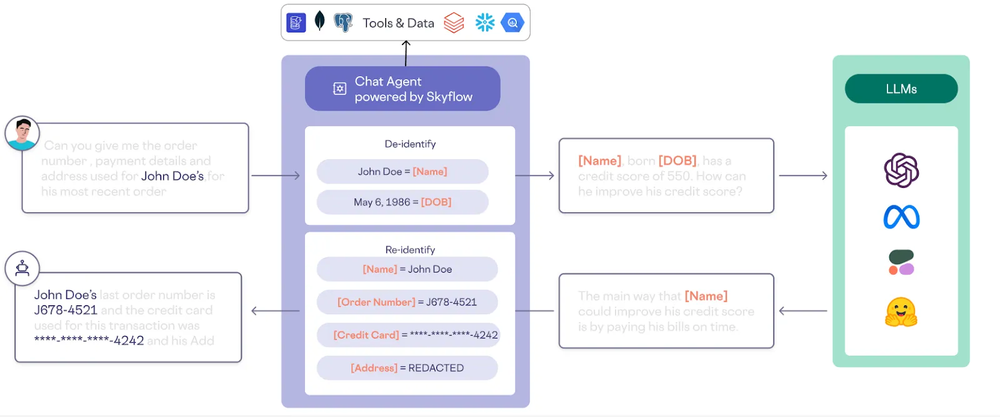

# AI Private Layer — OPS SDK & CLI

A privacy-preserving operational toolkit that enables organizations
to safely run and integrate AI models in compliance-sensitive environments.

AI Private Layer OPS provides:
- PII detection
- Masking & reversible tokenization
- Optional encryption layer
- Deterministic restoration
- Model-agnostic architecture

It is designed for regulated industries such as insurance,
finance, healthcare, and government, where AI adoption
must comply with strict data protection requirements.

This repository contains the **operational developer tooling** for the AI Private Layer ecosystem and is **not** the full backend/server – it is a library and CLI that can be embedded into your own services, data pipelines, and automation.

**Using AI in regulated environments and agents**

The diagram below shows how to use the model in practice: safely integrating AI in regulated industries and in agent workflows.




### 🚀 Quick start

```bash
pip install -e .
private-layer protect "Email me at john@example.com or call +1 555 123 4567."
```

Output includes:

- **masked_text** with placeholders like `[PII_1]`, `[PII_2]`, …
- **mapping** – a JSON-serializable structure that lets you restore the original text


### 🏗 Architecture overview

- **Core API**: `detect(text)`, `protect(text)`, `restore(masked_text, mapping)` (see `private_layer` package).
- **Detectors layer**: pluggable backends (`regex`, `local`, `ner`, `presidio`, `spacy`, `spacy_trf`, `flair`, `transformers`, `scrubadub_spacy`) selected via config or CLI.
- **Pipeline**:
  - detect candidate PII spans,
  - resolve overlaps deterministically,
  - replace spans with placeholders and build a reversible mapping,
  - restore placeholders back to original text when needed.
- **OPS focus**: this package is the **SDK & CLI** used by other Private Layer services. It can run fully locally (no network calls) and is suitable for embedding into ETL jobs, notebooks, and backend services.

For more details see `docs/architecture.md`.


### 📦 Installation

From the repo root:

```bash
pip install -e .
```

**Extras (optional):**

- **Local model support**: `pip install -e ".[local_model]"` (then add your model files under `src/private_layer/detectors/models/`)
- **Presidio detector**: `pip install -e ".[presidio]"`
- **spaCy detector**: `pip install -e ".[spacy]"` or `.[spacy_trf]`
- **Flair detector**: `pip install -e ".[flair]"`
- **Transformers NER detector**: `pip install -e ".[transformers_ner]"`
- **Scrubadub detector**: `pip install -e ".[scrubadub]"`
- **Encryption**: `pip install -e ".[crypto]"`
- **Dev tools & tests**: `pip install -e ".[dev]"`

All dependencies and extras are defined in `pyproject.toml`.

To run from a fresh virtualenv:

```bash
cd ai-private-layer-ops
python3 -m venv .venv
source .venv/bin/activate  # Windows: .venv\Scripts\activate
pip install -e .
private-layer --help
private-layer detect "Email me at john@example.com" --format text
private-layer protect "Email me at john@example.com"
```


### 🧠 CLI usage

**Basic commands:**

```bash
# Detect PII
private-layer detect "Email me at john@example.com or +1 555 123 4567" --format text

# Protect text (mask + mapping)
private-layer protect "Email me at john@example.com"

# Restore original text from mapping
private-layer restore 'Contact [PII_1]' \
  '[{"placeholder":"[PII_1]","label":"email","original_text":"jane@example.com"}]'
```

**Detector selection and options:**

- **`-p, --detector`**: choose backend (`regex`, `local`, `ner`, `presidio`, `spacy`, `spacy_trf`, `flair`, `transformers`, `scrubadub_spacy`)
- **`-d, --use-local` + `-m, --local-model NAME`**: use local model from `detectors/models/NAME`
- **`-c, --config PATH`**: YAML config file
- **`-f, --format`**: output format (`json` | `text`)

If `private-layer` is not on `PATH`:

```bash
PYTHONPATH=src python -m private_layer detect "text"
```


### 📦 SDK usage (Python)

```python
from private_layer import detect, protect, restore

result = protect("Contact jane@example.com")
print(result.masked_text)  # "Contact [PII_1]"

original = restore(result.masked_text, result.mapping)
print(original)
```

- **`detect(text, config=None)`** → list of detected spans
- **`protect(text, ...)`** → `masked_text` and `mapping`
- **`restore(masked_text, mapping)`** → original string

See `examples/quickstart.py` and `examples/dataset_demo.py` for more complete flows.


### ⚙️ Local models

Local models live under:

```text
src/private_layer/detectors/models/<model_name>/
```

**Usage:**

```bash
private-layer detect "John lives in Berlin" -d --local-model private-layer-v1
private-layer protect "John lives in Berlin" -d --local-model private-layer-v1 --format text
```

**Model requirements:**

- Hugging Face–style directory with `config.json`, tokenizer files, and weights **or**
- A model class exposing `predict_entities(text, labels, threshold=...)` (used by the local detector).

Details: `src/private_layer/detectors/local_model_detector.py`.


### 🧠 Configuration

Configuration is a single YAML file (no tenants). Core keys:

```yaml
detector_type: regex            # regex, local, ner, presidio, spacy, spacy_trf, flair, transformers, scrubadub_spacy
local_model_name: private-layer-v1
labels:
  - email
  - phone
threshold: 0.5
per_label_thresholds:
  email: 0.6
  phone: 0.7
regex_rules:
  email:
    pattern: ...
tokenization:
  placeholder_format: "[PII_{i}]"
  immutable: true
  include_hash: false
output:
  include_mapping: true
```

If no config is provided, a built-in default config (regex-based) is used. See `config.example.yml` and `docs/config_reference.md` for all supported options.


### 🔐 Encryption (optional)

Encryption is an **optional** extra that encrypts the mapping bundles while keeping placeholders immutable.

**Install and configure:**

```bash
pip install -e ".[crypto]"
export TOKEN_KEY_HEX=$(openssl rand -hex 32)  # 32 bytes hex key
```

**CLI flow with encryption:**

```bash
# Mask + encrypt: write masked_text + bundles to JSON
private-layer protect "Email john@example.com" --encrypt > out.json

# Decrypt and restore later
private-layer decrypt "$(jq -r '.masked_text' out.json)" \
  "$(jq -c '.bundles' out.json)"
```

Internally encryption uses **AES-GCM** over PII-bearing bundles; placeholders remain deterministic and immutable.

For lower-level APIs, see `private_layer.pipeline.encrypt` and `private_layer.pipeline.decrypt`.


### 🌟 Demo Applications

Check out these full-stack applications demonstrating how to integrate the **AI Private Layer** in real-world scenarios:

- 💬 **[Chat Assistant Demo](https://github.com/Azizbek-Analyst/ai_private_layer_chat_demo)**: A text-based AI chat application with PII detection, masking, and restoration.
- 🎙️ **[Voice Agent Demo](https://github.com/Azizbek-Analyst/ai_private_layer_voice_demo)**: A real-time voice-to-voice AI agent featuring automated privacy-preserving data processing.


### 📁 Examples

```bash
# Regex (default)
private-layer detect "Email me at john@example.com or +1 555 123 4567" --format text
private-layer protect "Email me at john@example.com"

# Local model (model folder under src/private_layer/detectors/models)
private-layer detect "John lives in Berlin" -d --local-model private-layer-v1
private-layer protect "John lives in Berlin" -d --local-model private-layer-v1 --format text

# Other detectors (install extra, e.g. .[presidio])
private-layer detect "Hi, I am Jane Doe" -p presidio
private-layer detect "John in Berlin" -p spacy --format text

# Restore
private-layer restore 'Contact [PII_1]' \
  '[{"placeholder":"[PII_1]","label":"email","original_text":"jane@example.com"}]'

# Encryption: write to JSON and decrypt from JSON (pip install -e ".[crypto]", TOKEN_KEY_HEX)
export TOKEN_KEY_HEX=$(openssl rand -hex 32)
private-layer protect "Secret: alice@example.com" --encrypt > out.json
private-layer decrypt "$(jq -r '.masked_text' out.json)" "$(jq -c '.bundles' out.json)"

# JSONL
echo '{"text":"Email alice@test.com"}' > in.jsonl
private-layer dataset protect -i in.jsonl -o out.jsonl -d --local-model private-layer-v1
```


### 🧪 Tests

Install dev dependencies and run tests:

```bash
pip install -e ".[dev]"
pytest
```

Focus areas:

- **No PII leakage** in logs or test fixtures
- **Detector quality**: precision/recall for different backends


### 🙌 Contributing & support

This is my first open-source project in the **secure AI** space. I’d be glad to hear from you — feedback, ideas, or just a “hello”. You can reach me by **email** ([support@private-layer.ai](mailto:support@private-layer.ai)), **Telegram** ([@azizbek_mwa](https://t.me/azizbek_mwa)), or **Discord** (azizbek_kzt). My mission is to make AI **accessible and safe for everyone**.

- **Issues & ideas**: use the GitHub issue tracker for bug reports and feature requests.
- **PRs**: see `CONTRIBUTING.md` for guidelines and expectations.
- **Community standards**: see `CODE_OF_CONDUCT.md`.
- **Security & disclosure**: see `SECURITY.md`.
- Please avoid including real PII in code, tests, or issues – use synthetic examples.

For more about the broader ecosystem, visit [private-layer.ai](https://private-layer.ai).


### 📜 License

Apache-2.0
